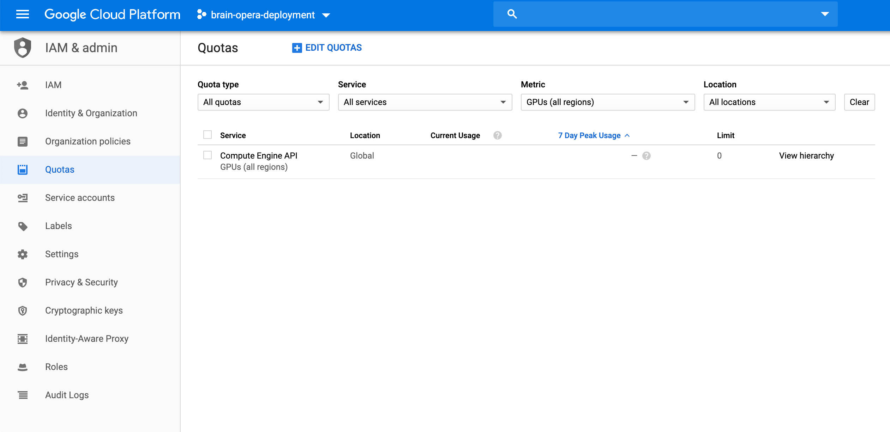

# Deploying model on GCP virtual machine

## Steps to deploy

1. **Create a Google Cloud Platform account**

2. **Install Cloud SDK and enable Google Kubernetes Engine API**

Follow the the steps for installing cloud SDK:
<https://cloud.google.com/sdk/install>

3. **After installing Cloud SDK, initialize it**

```sh
# Run the following command to initialize
# This will ask you to link your Google Cloud Platform account
gcloud init
```

4. **Create and configure GCP project**

```sh
# This commands creates a project with the name `brain-opera-deployment`
gcloud projects create brain-opera-deployment

# Set your working project
gcloud config set project brain-opera-deployment

# Set compute zone
gcloud config set compute/zone asia-southeast1-b
```

5. **Set quota for GPU**

The default GPU quota for a GCP account with free credits is 0.
A request for an increase in this quota is necessary to use GPUs.

Go to <https://console.cloud.google.com/iam-admin/quotas>.
Make sure that `brain-opera-deployment` is chosen as the project in the header, as shown in the image below.
Filter metric by `GPUs (all regions)`. If the limit is 0, tick the checkbox and click on the `Edit Quotas` button at the top.



Fill in the necessary info and request for the limit to be raised to 1.
An email will be sent to you for the quota request.
The wait time is usually a few hours before the quota request is granted.

6 **Set firewall rules**
This only needs to be done once.

```sh
gcloud compute --project=brain-opera-deployment firewall-rules create brain-opera-port8000 --direction=INGRESS --priority=1000 --network=default --action=ALLOW --rules=tcp:8000 --source-ranges=0.0.0.0/0 --target-tags=port8000
```

7. **Create VM**

```sh
export IMAGE_FAMILY="tf-1-14-cu100"
export ZONE="asia-southeast1-b"
export INSTANCE_NAME="brain-opera-gpt2"
export INSTANCE_TYPE="n1-standard-2"

gcloud compute instances create $INSTANCE_NAME \
        --zone=$ZONE \
        --image-family=$IMAGE_FAMILY \
        --image-project=deeplearning-platform-release \
        --maintenance-policy=TERMINATE \
        --accelerator="type=nvidia-tesla-p4,count=1" \
        --machine-type=$INSTANCE_TYPE \
        --boot-disk-size=30GB \
        --metadata="install-nvidia-driver=True"
        --tags=port8000
```

8. **Setup VM**

```sh
# SSH into machine
gcloud compute --project "brain-opera-deployment" ssh --zone "asia-southeast1-b" "brain-opera-gpt2"

# Clone repo
git clone https://github.com/jonheng/brain-opera-gpt2-deployment.git

# Go to cloned repo
cd brain-opera-gpt2-deployment/

# Install python3-venv
sudo apt-get install python3-venv

python3 -m venv .venv
source .venv/bin/activate
pip install -r requirements.txt
CMD gunicorn -b :8000 server:app
```

9. **Final test**

```sh
gcloud compute instances list
```
